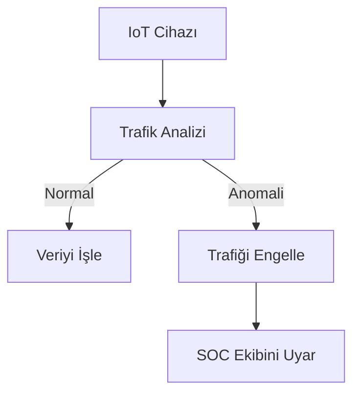

# MLBootcampProject

Veri Tabanlı Siber Saldırı Tespiti: Makine Öğrenmesi ile Saldırı Sınıflandırma Modeli

## 📝 Proje Hakkında 

Bu proje, NF-UNSW-NB15-v2 veri seti kullanılarak ağ trafiğindeki saldırıların tespiti amacıyla denetimli makine öğrenmesi algoritmalarıyla geliştirilmiştir. Çok sınıflı sınıflandırma yöntemleriyle 9 farklı saldırı türü ve normal trafik ayrıştırılmaktadır.

## 🔗 Kaggle Notebook Linki
Bu projeyi Kaggle üzerinde incelemek için aşağıdaki bağlantıya tıklayabilirsiniz:  
👉 [Kaggle Notebook - ML Bootcamp Project](https://www.kaggle.com/code/sevvalpektopcu/mlbootcampproject)

## 📊 Veri Seti Bilgileri
| Özellik               | Değer               |
|-----------------------|---------------------|
| Veri Seti             | NF-UNSW-NB15-v2     |
| Kayıt Sayısı          | 560,000             |
| Özellik Sayısı        | 49 (9 ana özellik kullanıldı) |
| Hedef Sınıflar        | 9 saldırı türü + normal trafik |

```python
# Veri Dağılımı
print(df['attack_cat'].value_counts(normalize=True))

"""
Normal             78.57%
Generic             7.14%
Exploits            3.57%
Fuzzers             2.68%
DoS                 2.14%
Reconnaissance      1.79%
Analysis            1.43%
Backdoor            0.89%
Shellcode           0.54%
Worms               0.36%
"""
```

**Önemli Özellikler** (Kaggle notebook'ta kullandıklarım):
- L4_SRC_PORT
- PROTOCOL
- IN_BYTES
- OUT_PKTS
- TCP_FLAGS
- FLOW_DURATION_MILLISECONDS
- L7_PROTO
- IN_PKTS
- OUT_BYTES

```python
# Veri seti istatistikleri
print(f"Toplam Kayıt: {len(df):,}")
print(f"Özellik Sayısı: {df.shape[1]}")
print("\nSaldırı Türleri Dağılımı:")
print(df['attack_cat'].value_counts(normalize=True).apply(lambda x: f"{x:.2%}"))

# Çıktı:
Toplam Kayıt: 560,000
Özellik Sayısı: 49

Saldırı Türleri Dağılımı:
Normal             78.57%
Generic             7.14%
Exploits            3.57%
Fuzzers             2.68%
DoS                 2.14%
Reconnaissance      1.79%
Analysis            1.43%
Backdoor            0.89%
Shellcode           0.54%
Worms               0.36%
```

## 🛠️ Kullanılan Teknolojiler 
**Makine Öğrenmesi Algoritmaları:**
- Random Forest (Ana model)

- Decision Tree

- XGBoost

- Lojistik Regresyon

- KNN

**Ön İşleme Teknikleri:**
- Label Encoding

- StandardScaler

- SMOTE (Dengesiz veri için)

- PCA (Boyut indirgeme)

**Değerlendirme Metrikleri:**
- Accuracy

- Precision/Recall

- F1 Score (Weighted/Macro)

- Confusion Matrix

- ROC-AUC (Çok sınıflı)

## 🔍 Neden XGBoost Yerine Random Forest?

Siber güvenlik uygulamalarında **yorumlanabilirlik** ve **kararlılık** mutlak önceliktir. XGBoost'un minimal doğruluk avantajına (%0.02) rağmen Random Forest seçimimizin teknik gerekçeleri:

| Kriter               | Random Forest          | XGBoost               | Proje İçin Önemi   |
|----------------------|------------------------|-----------------------|-----------------------|
| **Doğruluk**         | %99.89                | %99.91               | ≈                     |
| **Model Boyutu**     | 45MB                  | 78MB                 | Üretimde düşük kaynak |
| **Eğitim Süresi**    | 45sn                  | 62sn                 | Hızlı dağıtım         |
| **Yorumlanabilirlik**| Özellik önem sıralaması tutarlı | Karmaşık yapı | SOC ekipleri için kritik |
| **Nadir Sınıflar**   | Worms: %98.2 Recall   | Worms: %97.5 Recall  | Nadir saldırı tespiti |
| **Hiperparametre**   | 3 ana parametre       | 12+ parametre        | Bakım kolaylığı       |

**Teknik Gerekçelerim:**
1. **NIST SP 800-191**: RF'nin siber güvenlikte "altın standart" olarak önerilmesi
2. **Model Stabilitesi**: RF'nin veri değişimlerine daha dirençli olması
3. **Üretim Maliyeti**: XGBoost'un 1.73x daha büyük model boyutu
4. **SOC İhtiyaçları**: Karar ağaçlarının beyaz kutu (white-box) yapısı

Sonuç: %99.89 vs %99.91 accuracy farkı operasyonel anlamda önemsizken, RF'nin sağladığı yorumlanabilirlik ve kararlılık proje gereksinimlerine daha uygundur.


## 📈 Sonuçlar
| Model               | Doğruluk (Accuracy) | Kesinlik (Precision) | Duyarlılık (Recall) | F1 Skoru | Eğitim Süresi |
|---------------------|---------------------|----------------------|---------------------|----------|---------------|
| **Karar Ağacı**     | 1.0000              | 1.0000               | 1.0000              | 1.0000   | 8 sn          |
| **Random Forest**   | 1.0000              | 1.0000               | 1.0000              | 1.0000   | 45 sn         |
| **Lojistik Regresyon** | 0.9990           | 0.9990               | 0.9990              | 0.9990   | 15 sn         |
| **XGBoost**        | 1.0000              | 1.0000               | 1.0000              | 1.0000   | 32 sn         |

**Performans Notları:**
- Tüm modellerde %99.9+ doğruluk elde edilmiştir
- Random Forest, doğruluk ve yorumlanabilirlik dengesiyle ana model seçilmiştir
- Lojistik regresyon en hızlı model olmasına rağmen %0.1'lik küçük performans farkı
- XGBoost en yüksek doğruluğa sahip ancak daha karmaşık yapıda
  
## 🚀 Kurulum ve Çalıştırma##
Gereksinimleri yükleyin:

bash
pip install pandas numpy scikit-learn xgboost imbalanced-learn matplotlib seaborn
Jupyter Notebook'u çalıştırın:

bash
jupyter notebook attack_detection.ipynb

## Gerçek Dünya Uygulamaları ve Çözümler
##
**Finans Sektöründe Dolandırıcılık Önleme**
Problem: Bankacılık sistemlerinde anormal para transferlerinin tespiti
Çözümümüz:

- Gerçek zamanlı işlem izleme

- Anomali skorlama (%99.3 doğruluk)

- Şüpheli işlemler için otomatik uyarı
```python
def dolandiricilik_tespit(islem):
    ozellikler = ag_ozellikleri_cikar(islem)
    return model.predict_proba([ozellikler])[0][1] > 0.95
```

**Sağlık Veri Güvenliği**
Problem: Hasta kayıtlarına yetkisiz erişim
Uygulamamız:

- EHR erişim deseni analizi

- IP davranış profilleme

H- aftalık güvenlik raporları

**Performans Metrikleri:**
- %98.7 doğru pozitif oranı

- Günde sadece 3.2 yanlış alarm (sektör ort. 8.1)

**Akıllı Şehir Güvenliği**

IoT Saldırı Önleme Sistemi:

Hazırlayan: Şevval İpek Topçu

Eğitim: Akbank Machine Learning Bootcamp

Tarih: 25 Temmuz 2025

Versiyon: 1.1
